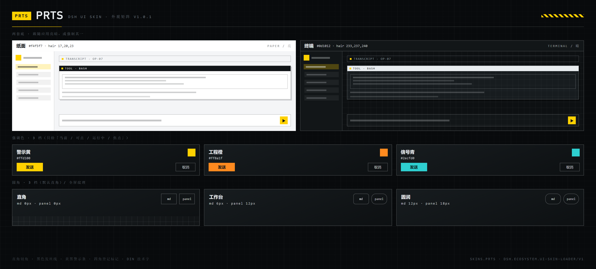

# PRTS · DSH UI 皮肤

[](https://github.com/topics/dsh-plugin)
[](https://github.com/deepseek-ai/deepseek-harness)
[](https://github.com/tenebris173/dsh-skin-prts/actions/workflows/test.yml)

> 罗德岛终端风格 · 直角切角 · 黑色发丝线 · 黄黑警示条 · DIN 技术字

按 **`dsh.ecosystem.ui-skin-loader/v1`** 公约实现的 DSH 皮肤包。装好后出现在
**设置 → 皮肤** 的卡片墙里，与其它皮肤并列，一键切换。



## 运行模式：有控制台 / 没控制台都能用

本皮肤**不依赖任何第三方控制台**，自己就能跑：

| 场景 | 行为 |
| --- | --- |
| **没装皮肤控制台**（默认） | **自立模式**：装完重启即自动应用外观；在「设置 → PRTS」里可以开关、调全部选项（关掉立刻恢复原生界面，随时再打开） |
| 装了皮肤控制台（参考实现 `@dsh-eac/ui-skin-loader`） | 自动登记托管：出现在 **设置 → 皮肤** 卡片墙里，由控制台负责互斥切换 / 持久化 / 故障隔离 |

两种模式共用同一套 token 与设置存储，**切换控制台不需要改皮肤**。

### 对控制台 / 脚本的接口

皮肤实现了公约 `dsh.ecosystem.ui-skin-loader/v1` 的 `registerSkin()`；此外无论哪种模式，
都暴露一个统一入口供控制台或脚本驱动：

```js
window.__dshSkins["skins.prts"]
// {
//   mode: "standalone" | "console",   // 当前运行模式
//   skinId, version,
//   isActive(),                      // 是否正在生效
//   activate(), deactivate(),        // 手动开关（自立模式下 activate 会接管 owner）
//   getSettings(), setSettings(patch) // 读写外观设置
// }
```

自立模式下多款皮肤共存时用 `localStorage["dsh.skin.standalone.owner.v1"]` 协商归属：
先启动的占位，后启动的让位（设置面板里给「改用本皮肤」按钮，点击后刷新即接管）。

> 控制台是**可选**的第三方插件，不随本包分发。想要卡片墙式管理再装它即可。


## 这是一个 DSH 插件

本仓库是 [DeepSeek Harness](https://github.com/deepseek-ai/deepseek-harness) 的插件（皮肤类）。
按官方 README「Community and support」一节的要求，仓库已打上
[`dsh-plugin`](https://github.com/topics/dsh-plugin) topic，便于在
[github.com/topics/dsh-plugin](https://github.com/topics/dsh-plugin) 被发现；
`package.json` 的 `keywords` 与 `dsh.skin.tags` 里同样带 `dsh-plugin`。

三种安装方式，任选其一：

| 方式 | 命令 / 操作 |
| --- | --- |
| git（无需下载包） | `dsh plugin --profile desktop add https://github.com/tenebris173/dsh-skin-prts` |
| 美化包 | 从 Releases 下 `PRTS-UI-*.zip`，双击 `安装PRTS皮肤.cmd` |
| 本地源码 | 见下方「安装 → B. 从源码装」 |

> 装完**必须重启 DSH**（插件包只在启动时进启动图），随后在 **设置 → 皮肤** 里一键切换。

> 配套的另一款：**深渊 ABYSSAL（深海玻璃拟态）** · <https://github.com/tenebris173/dsh-skin-abyssal>

## 外观

| 项 | 选项 | 默认 |
| --- | --- | --- |
| 外观 | 跟随应用 / 纸面（亮）/ 终端（暗） | 跟随应用 |
| 强调色 | 警示黄 / 工程橙 / 信号青 | 警示黄 |
| 圆角 | 直角 0px / 工作台 6px / 圆润 12px | 直角 |
| 纹理 | 全屏细网格 + 扫描线 + 四角登记标记 | 开 |
| 硬投影 | 浮窗错位实心影 + 按钮按压位移 | 开 |
| DIN 技术字 | 拉丁文用 Bahnschrift（中文回落雅黑） | 开 |

3 × 3 × 3 × 2 × 2 × 2 = **216 种组合**，改档即时生效并跨重启保留
（皮肤自治：`localStorage`，键 `dsh.skin.prts.preferences.v1`）。

**跟随应用**：读 `ctx.theme.getTheme().preference`，为 `system` 时用 `prefers-color-scheme`
判定；1s 轮询 + `matchMedia` 监听，应用换主题时自动重算。

## 两套底

| | 纸面（Paper · 亮） | 终端（Terminal · 暗） |
| --- | --- | --- |
| 底 / 面板 / 卡片 | `#f4f5f7` / `#ffffff` / `#ffffff` | `#0d1012` / `#121618` / `#171c1f` |
| 发丝线 | 黑 18–60% | 冷白 15–60% |
| 实心块（徽标 / 主按钮 / DONE 章） | 黑底白字 | **反相**：冷白底深字 |
| 代码 token | `#1d3f63` `#7a4b12` `#b5342a` | `#8ab7ea` `#e0a45c` `#ff9a8a` |
| 警示黄 | `#ffd100` | `#ffd100` |

## 安装

### A. 用打包好的美化包（推荐给最终用户）

下载 release 里的 `PRTS-UI-*.zip`，解压后双击 `安装PRTS皮肤.cmd`。脚本会找到本机 DSH
（优先用你**正在运行**的那个），用官方途径装进 `desktop` profile，并把 `activeSkin` 切到本皮肤。

### B. 从源码装（开发）

```powershell
# 应用目录（默认装在当前用户的 LocalAppData 下；装在 Program Files 时改成对应路径）
$app = "$env:LOCALAPPDATA\Programs\DeepSeek Harness"
$cli = "$app\resources\app.asar\dsh\node_modules\@deepseek-ai\dsh-desktop-host\lib\cli.js"

# 以软链方式安装（改代码刷新即生效）
& "$app\DeepSeek Harness.exe" $cli plugin --profile desktop add "<本仓库绝对路径>"

# 卸载
& "$app\DeepSeek Harness.exe" $cli plugin --profile desktop remove dsh-skin-prts
```

装完**必须重启 DSH**（新增插件包只在启动时进启动图）。切换皮肤也可以直接在
**设置 → 皮肤** 里点，不必手改配置。

## 设计语言

1. **纸面/终端，不是"深色科幻"** —— 层级只靠 1px 线与明度差，零阴影、零光晕、零圆角。
2. **切角而非圆角** —— `border-radius: 0`；面板头是黑底白字条 + 黄色 ▶；浮窗用错位实心影。
3. **警示黄只给四处** —— 当前 / 可点 / 运行中 / 焦点；其余全部黑白灰。
4. **DIN 技术字 + 字距** —— 拉丁文 Bahnschrift 大写标签；中文雅黑托底；数字等宽。

## 实现要点

- **观感承载**：`theme.overrideTokens()` 覆盖宿主公开 token —— `--dsw-alias-*`(107)、
  `--dsw-specific-*`(11)、`--dsw-menu-*`、`--dsw-linear-*`、`--dsw-radius-*`（直角 0）、
  `--dsw-static-neutral(-bluish)-*` 中性灰阶、`--dsw-font-family` / `--ds-font-family-code`。
- **驱动宿主亮暗开关**：`body[data-ds-dark-theme]` 由皮肤按有效底置位 / 摘除 —— 否则
  `--dsw-specific-*` 这类"只在 scheme 分支里有定义"的表面会落在错误的一档（实测过：
  纸面模式下输入框仍是深色）。
- **浮层实色兜底**：`[role="dialog"] / [aria-modal] / [role="menu|listbox|tooltip"]`
  强制实色 + 直角（PRTS 的表面本就是实心的，弹窗天然不透出正文）。
- **装饰层**：注入 7 个自有节点（网格、扫描线、左缘警示条、四角登记标记），
  `pointer-events:none` + `z-index:1`（低于菜单 100 / 弹窗 1000），退出时整体移除。
- **生命周期**（公约 §4.3 / R8）：activate 的每项副作用都登记 disposer，teardown 幂等；
  `deactivate` / `skinCtx.signal` abort / fiber 意外 dispose 三路汇合，退出后 token 与节点全部还原。
- **主题注册兜底**：重复 id 时改用带序号的 id，皮肤重载后不会整次回滚成默认。
- **设置面板**：经 `settings.section` 席位注册 React 组件，只在皮肤激活时出现。

## 自测

| 脚本 | 覆盖 | 断言 |
| --- | --- | --- |
| `tests/browser-smoke.mjs` | 控制台路径：登记载荷 / 激活副作用 / **真实 CSS 层叠** / 改档重算 / teardown 净场 | 32 |
| `tests/standalone.mjs` | **无控制台**：自动生效 / 统一接口 `window.__dshSkins` / 开关能卸能装 / 多皮肤让位 / 卸载全清 | 15 |
| `tests/dependency-check.mjs` | 宿主半依赖自检（缺服务时的提示） | 7 |
| `tests/restore-native.mjs` | **还原原生皮肤**：自立模式关开关 / 控制台模式请它 `switchTo("default")` | 17 |

```powershell
# 真实浏览器引擎里跑真实 bundle（需 Chrome 以 --remote-debugging-port=9222 启动）
node tests/browser-smoke.mjs
```

32 项断言：登记载荷 → activate 副作用 → 装饰层 7 节点 → **两套底的真实 CSS 层叠**
（`getComputedStyle` 读 token 与弹窗实色）→ 跟随应用主题切换 → 纹理 / 投影开关 → teardown 净场。

### 端到端扫测（注入真实 DSH 页面）

```bash
# 1) 起一个 DSH 页面，记下打印的 URL
dsh web --no-open --port 0
# 2) 让 Chrome 开着 CDP
google-chrome --headless=new --remote-debugging-port=9222 --user-data-dir=/tmp/cdp about:blank
# 3) 跑
node tests/e2e-sweep.mjs "<上面那个 URL>" e2e-out
```

把 bundle 注入**正在运行的 DSH 页面**实跑一轮：激活副作用 → 逐档切换（真实 `getComputedStyle` 读值）→
CDP 模拟系统亮色 → 连切 10 次压力 → 真实设置弹窗 → `deactivate` 净场 → 二次激活 →
全程采集 `Runtime.exceptionThrown` 与 `console.error/warning`。

> 截图会存到 `e2e-out/`，**可能包含本机会话信息，不要外传**；`e2e-report.json` 里 URL 的 token 会自动打码。

## 目录

```
lib/index.js          宿主半（空 apply：观感全在 client 半）
lib/client.js         皮肤本体（登记 / token 表 / 两套底 / 外观面板 / 生命周期）
cordis.patch.yml      bundle patch（row id = 设置命名空间）
install/              一键安装 / 卸载脚本（美化包同款）
preview/              外观矩阵图 + 卡片预览 SVG
tests/browser-smoke.mjs
```

## 更新记录

见 [CHANGELOG.md](CHANGELOG.md)。

## 许可

MIT。
